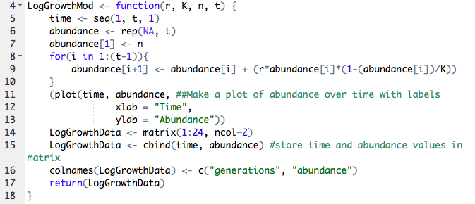

# Implementing a Discrete-Time Logistic Growth Model with Code

The file [Colbert_Lab8.R](https://github.com/brusselsproutshawty/CompBioLabsAndHomework/blob/master/Labs/Lab08/Colbert_Lab8.R) is a script containing a function that generates data on abundance over time that is then plotted and saved in a data file, which can be seen on github [here](https://github.com/brusselsproutshawty/CompBioLabsAndHomework/blob/master/Labs/Lab08/LogGrowthResults.csv).

### Part 1: Understanding the Function

To model population abundance over time we use this discrete-time logistic equation:

>  ****_n[t] = n[t-1] + (r * n[t-1] * (K - n[t-1])/K)_****

where each variable represents a parameter that is put into the argument of the function. The parameters, their meanings and my values are as follows:

* r = growth rate = 0.7
* K = carrying capacity = 14000
* n = initial population size = 600
* t = time/number of generations = 14

To model this equation with these parameters they are placed in the argument of the function _LogGrowthMod_. The code for the function is: 

Looking at this function, you may notice that it does much more than just compute the results of the logarithmic growth equation. This function creates a matrix with the data of abundance and time but also creates a plot of the data. For my specific parameter values, the function outputted this plot of abundance over time: 

### Part 2: What's in the data file?

As noted above, this script also uses specific data created by the function to write a new data file. This data file includes the matrix created by the function for a **specific set of parameters** put into the argument of the function. The matrix has two columns, the first which stores the number of **generations**,  while the second stores the **population abundance** at that specific number of generations. Now you've got a cool new CSV file with lots of data you can play around with or use for other visuals/statistical analyses!

### And there you have it folks! Thanks for exploring this script with me! 
